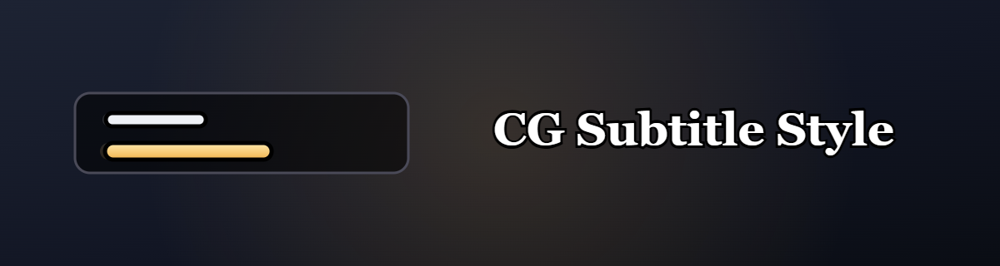

English | [简体中文](docs/README.zhCN.md) | [繁體中文](docs/README.zhTW.md)

---

Custom styling for WoW's native cinematic (cutscene) subtitles: the speaker and
the subtitle content are rendered as two separate lines, each fully
customizable — fonts, colors, outlines, shadows, backgrounds and borders.

## Usage

Open the settings panel:

- **ESC → Options → AddOns → CG Subtitle Style**, or
- type `/cgs` (or `/cgsub`).

### General settings

| Setting | Description |
| --- | --- |
| Language | UI language: Auto (match client), 简体中文, 繁體中文, English |
| Enable subtitle styling | Master on/off switch |
| Respect game subtitle setting | Keep subtitles hidden when the in-game "Subtitles" option is off |
| Overall alpha | Transparency of the whole subtitle block |
| Anchor point | Screen anchor: center, top, bottom, corners, etc. |
| Horizontal / vertical offset | Position offset from the anchor |
| Max subtitle width | Maximum width of each line |
| Speaker/content gap | Spacing between the speaker line and the content line |

### Speaker / Subtitle tabs

Each line has the same five tabs:

| Tab | Options |
| --- | --- |
| Text | Font, font size, text color |
| Outline | Style (none / thin / thick / custom), color, custom width |
| Shadow | Enable, shadow color |
| Background | Enable, color, opacity |
| Border | Enable, style (solid / rounded tooltip / dialog), color, thickness, padding |

### Themes

- **Save as new theme** — save the current settings under a name.
- **Delete theme** — remove the active theme (the default theme cannot be
  deleted).
- **Export theme** — generate a text snippet describing the current theme.
- **Import theme** — paste a shared snippet and click *Import theme*.
- **Reset current theme** — restore the default settings.

Exported theme text is plain text (Base64). Share it with friends or import
someone else's theme directly.

## Slash commands

| Command | Description |
| --- | --- |
| `/cgs` | Open the settings panel |
| `/cgs help` | Show command help |
| `/cgs preview` | Toggle the subtitle preview |
| `/cgs reset` | Reset the current theme |
| `/cgs on` / `/cgs off` | Enable / disable subtitle styling |
| `/cgs theme <name>` | Apply a saved theme |
| `/cgs themes` | List saved themes |
| `/cgs save <name>` | Save current settings as a new theme |
| `/cgs delete <name>` | Delete a theme |
| `/cgs export` | Export the current theme as text |
| `/cgs import <text>` | Import a theme from text |
| `/cgs language <auto\|zhCN\|zhTW\|enUS>` | Set the UI language |

## Compatibility

- **Retail** v12.0.1 — `## Interface: 120001`.

## Disclaimer

This addon is not affiliated with or endorsed by Blizzard Entertainment.
World of Warcraft is a registered trademark of Blizzard Entertainment, Inc.